# Validation report

Generated by `cfd-cli verify --full` (cfd-cli 0.1.0). Method and cases: [08 — Validation guide](../../docs/08-validation-guide.md); tolerances: [04 §7](../../docs/04-numerical-methods.md#7-validation). Reference data with sources: [`validation/references/`](../references/).

| Level | Backend | Collision | Threads | CPU | Commit | Total time | Result |
|-------|---------|-----------|---------|-----|--------|------------|--------|
| full | cpu | trt | 16 | AMD Ryzen 7 3700X 8-Core Processor | 727020d-dirty | 1351 s | 12/12 cases pass |

## Summary

| Case | Result | Checks | Time |
|------|--------|--------|------|
| [Taylor-Green vortex decay](#taylor-green) | ✅ pass | ✅ velocity L2 error at N = 32 = 0.003903 ✅ convergence order (fit, N ≤ 128) = 2.157 ✅ energy decay-rate error at N = 256 = 2.276e-4 | 8.3 s |
| [Plane Poiseuille flow (body force)](#poiseuille) | ✅ pass | ✅ u(y) L2 error at N = 32 = 6.288e-6 ✅ largest L2 error, N ≤ 32 (exact scheme) = 6.606e-6 ✅ wall shear stress error at N = 64 = 1.458e-5 | 2.2 s |
| [Plane Couette flow (moving wall)](#couette) | ✅ pass | ✅ u(y) L2 error at N = 16 = 3.319e-6 ✅ u(y) L2 error at N = 32 = 1.351e-5 ✅ wall shear stress error at N = 32 = 6.032e-5 | 0.3 s |
| [Lid-driven cavity, Re = 100](#cavity-re100) | ✅ pass | ✅ max \|u − u_Ghia\| / U at N = 256 = 0.005184 ✅ max \|v − v_Ghia\| / U at N = 256 = 0.008772 | 32.6 s |
| [Lid-driven cavity, Re = 400](#cavity-re400) | ✅ pass | ✅ max \|u − u_Ghia\| / U at N = 256 = 0.003259 ✅ max \|v − v_Ghia\| / U at N = 256 = 0.005310 | 75.9 s |
| [Lid-driven cavity, Re = 1000](#cavity-re1000) | ✅ pass | ✅ max \|u − u_Ghia\| / U at N = 256 = 0.006430 ✅ max \|v − v_Ghia\| / U at N = 256 = 0.01603 | 115.2 s |
| [Cylinder in a channel, Re = 20 (Schäfer-Turek 2D-1)](#cylinder-re20) | ✅ pass | ✅ C_D at D = 40 cells = 5.600 | 68.3 s |
| [Cylinder in a channel, Re = 100 (Schäfer-Turek 2D-2)](#cylinder-re100) | ✅ pass | ✅ St at D = 80 cells = 0.3000 ✅ C_D,max at D = 80 cells = 3.258 | 761.6 s |
| [Differentially heated cavity, Ra = 1e3](#heated-cavity-ra1e3) | ✅ pass | ✅ Nu on the hot wall at N = 128 = 1.118 ✅ Nū (cavity average) at N = 128 = 1.118 | 6.9 s |
| [Differentially heated cavity, Ra = 1e4](#heated-cavity-ra1e4) | ✅ pass | ✅ Nu on the hot wall at N = 128 = 2.245 ✅ Nū (cavity average) at N = 128 = 2.245 | 12.3 s |
| [Differentially heated cavity, Ra = 1e5](#heated-cavity-ra1e5) | ✅ pass | ✅ Nu on the hot wall at N = 128 = 4.526 ✅ Nū (cavity average) at N = 128 = 4.525 | 23.1 s |
| [Differentially heated cavity, Ra = 1e6](#heated-cavity-ra1e6) | ✅ pass | ✅ Nu on the hot wall at N = 256 = 8.833 ✅ Nū (cavity average) at N = 256 = 8.831 | 244.6 s |

## Taylor-Green vortex decay — ✅ pass

*Case `taylor-green`. Reference: Analytical: u = U e^(−2νk²t) (−cos kx sin ky, sin kx cos ky).*

Periodic 1 m box, ν = 0.01 m²/s, U = 0.128 m/s (Re = UL/ν = 12.8), run for one viscous time 1/(2νk²) = 1.267 s. Diffusive scaling: u_lb = 0.64/N (τ = 0.65). Error: relative L2 of the velocity field; decay rate from the kinetic energy.

| Quantity | Value | Reference | Error | Limit | Result |
|----------|-------|-----------|-------|-------|--------|
| velocity L2 error at N = 32 | 0.003903 | 0 (limit 1%) | 0.003903 | 0.01000 | ✅ pass |
| convergence order (fit, N ≤ 128) | 2.157 | 1.800 – 2.300 | 0 | 0 | ✅ pass |
| energy decay-rate error at N = 256 | 2.276e-4 | 0 (limit 1%) | 2.276e-4 | 0.01000 | ✅ pass |

**Convergence**

| N | velocity L2 error | order | decay-rate error | note |
|---|---|---|---|---|
| 16 | 1.569e-2 | — | 1.575e-2 |  |
| 32 | 3.903e-3 | 2.01 | 3.908e-3 |  |
| 64 | 9.550e-4 | 2.03 | 9.540e-4 |  |
| 128 | 1.719e-4 | 2.47 | 1.708e-4 |  |
| 256 | 2.276e-4 | -0.41 | 2.276e-4 | f32 round-off floor (ADR-015), not fitted |

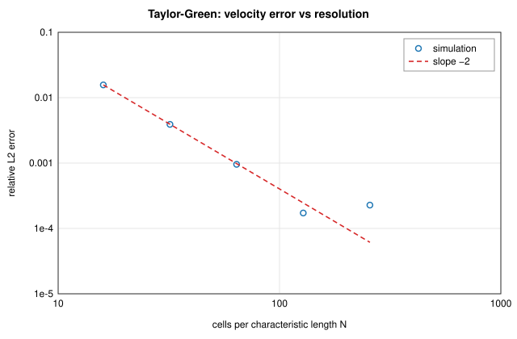

Runs

| Run | Fluid cells | Steps | Time | MLUPS | Converged |
|-----|-------------|-------|------|-------|-----------|
| N = 16 | 256 | 65 | 0.0 s | 5 | — |
| N = 32 | 1024 | 259 | 0.0 s | 21 | — |
| N = 64 | 4096 | 1038 | 0.1 s | 45 | — |
| N = 128 | 16384 | 4150 | 0.6 s | 108 | — |
| N = 256 | 65536 | 16600 | 7.6 s | 144 | — |

## Plane Poiseuille flow (body force) — ✅ pass

*Case `poiseuille`. Reference: Analytical: u(y) = G y (H − y) / (2ν).*

Channel of height H = 1 m between no-slip walls, periodic in x, driven by a body acceleration G = 8 m/s² (u_max = 1 m/s, Re = 1, τ = 1). Run to steady state (relative change per 0.1 diffusive time < 1e-6). Error: relative L2 of u(y); wall shear stress from momentum exchange against ρGH/2.

| Quantity | Value | Reference | Error | Limit | Result |
|----------|-------|-----------|-------|-------|--------|
| u(y) L2 error at N = 32 | 6.288e-6 | 0 (limit 1%) | 6.288e-6 | 0.01000 | ✅ pass |
| largest L2 error, N ≤ 32 (exact scheme) | 6.606e-6 | < 1e-5 | 6.606e-6 | 1.000e-5 | ✅ pass |
| wall shear stress error at N = 64 | 1.458e-5 | 0 (limit 1%) | 1.458e-5 | 0.01000 | ✅ pass |

**Convergence**

| N | u(y) L2 error | order | wall-shear error | note |
|---|---|---|---|---|
| 8 | 2.032e-6 | — | 1.200e-6 |  |
| 16 | 6.606e-6 | -1.70 | 5.558e-6 |  |
| 32 | 6.288e-6 | 0.07 | 5.540e-6 |  |
| 64 | 4.010e-5 | -2.67 | 1.458e-5 | f32 round-off floor (ADR-015), not fitted |

Runs

| Run | Fluid cells | Steps | Time | MLUPS | Converged |
|-----|-------------|-------|------|-------|-----------|
| N = 8 | 32 | 550 | 0.0 s | 1 | yes |
| N = 16 | 64 | 2142 | 0.1 s | 2 | yes |
| N = 32 | 128 | 7982 | 0.2 s | 4 | yes |
| N = 64 | 256 | 39312 | 1.9 s | 5 | yes |

## Plane Couette flow (moving wall) — ✅ pass

*Case `couette`. Reference: Analytical: u(y) = U y / H.*

Channel of height H = 1 m, top wall moving at U = 1 m/s, periodic in x (Re = 1, τ = 1). Run to steady state. Error: relative L2 of u(y); shear stress ρνU/H on both walls from momentum exchange.

| Quantity | Value | Reference | Error | Limit | Result |
|----------|-------|-----------|-------|-------|--------|
| u(y) L2 error at N = 16 | 3.319e-6 | 0 (limit 1%) | 3.319e-6 | 0.01000 | ✅ pass |
| u(y) L2 error at N = 32 | 1.351e-5 | 0 (limit 1%) | 1.351e-5 | 0.01000 | ✅ pass |
| wall shear stress error at N = 32 | 6.032e-5 | 0 (limit 1%) | 6.032e-5 | 0.01000 | ✅ pass |

**Results (exact shear stress ±1 Pa)**

| N | u(y) L2 error | bottom wall τ (Pa) | top wall τ (Pa) |
|---|---|---|---|
| 16 | 3.319e-6 | 1.0000 | -1.000 |
| 32 | 1.351e-5 | 1.0000 | -1.000 |

Runs

| Run | Fluid cells | Steps | Time | MLUPS | Converged |
|-----|-------------|-------|------|-------|-----------|
| N = 16 | 64 | 1989 | 0.0 s | 3 | yes |
| N = 32 | 128 | 7368 | 0.2 s | 4 | yes |

## Lid-driven cavity, Re = 100 — ✅ pass

*Case `cavity-re100`. Reference: Ghia, Ghia & Shin (1982), J. Comput. Phys. 48, 387–411, Tables I–II.*

Square cavity of side 1 m, lid at 1 m/s, ν = 0.0100 m²/s; N² fluid cells, lid lattice velocity 0.08 (Ma ≈ 0.14). Run until the relative change of u over half a lid transit is below 1e-5. The centreline profiles are averaged over the two middle columns/rows and linearly interpolated (walls half-way) at Ghia's points; the 15 interior points of each profile are compared. Errors are relative to the lid velocity.

| Quantity | Value | Reference | Error | Limit | Result |
|----------|-------|-----------|-------|-------|--------|
| max \|u − u_Ghia\| / U at N = 256 | 0.005184 | 0 (limit 2%) | 0.005184 | 0.02000 | ✅ pass |
| max \|v − v_Ghia\| / U at N = 256 | 0.008772 | 0 (limit 2%) | 0.008772 | 0.02000 | ✅ pass |

**Deviation from Ghia et al. (1982) by resolution**

| N | max |Δu|/U | max |Δv|/U | u relative L2 | v relative L2 |
|---|---|---|---|---|
| 64 | 0.0052 | 0.0077 | 6.650e-3 | 3.056e-2 |
| 128 | 0.0052 | 0.0085 | 6.784e-3 | 3.329e-2 |
| 256 | 0.0052 | 0.0088 | 6.711e-3 | 3.413e-2 |

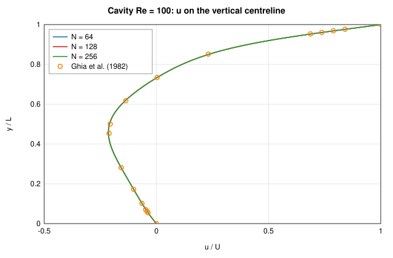

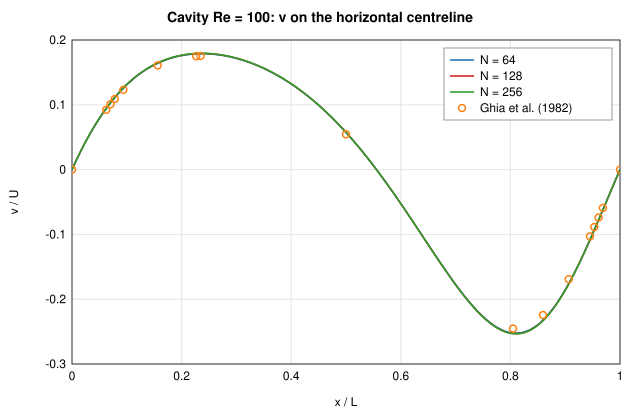

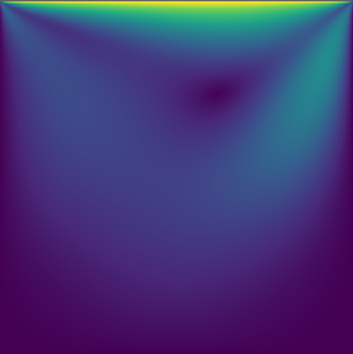
*Velocity magnitude |u|/U at Re = 100, N = 256*

Runs

| Run | Fluid cells | Steps | Time | MLUPS | Converged |
|-----|-------------|-------|------|-------|-----------|
| N = 64 | 4096 | 14400 | 1.2 s | 51 | yes |
| N = 128 | 16384 | 28800 | 4.4 s | 107 | yes |
| N = 256 | 65536 | 57600 | 27.0 s | 140 | yes |

## Lid-driven cavity, Re = 400 — ✅ pass

*Case `cavity-re400`. Reference: Ghia, Ghia & Shin (1982), J. Comput. Phys. 48, 387–411, Tables I–II.*

Square cavity of side 1 m, lid at 1 m/s, ν = 0.0025 m²/s; N² fluid cells, lid lattice velocity 0.08 (Ma ≈ 0.14). Run until the relative change of u over half a lid transit is below 1e-5. The centreline profiles are averaged over the two middle columns/rows and linearly interpolated (walls half-way) at Ghia's points; the 15 interior points of each profile are compared (the v point at x = 0.9063 is excluded: a known misprint in Ghia's Table II). Errors are relative to the lid velocity.

| Quantity | Value | Reference | Error | Limit | Result |
|----------|-------|-----------|-------|-------|--------|
| max \|u − u_Ghia\| / U at N = 256 | 0.003259 | 0 (limit 2%) | 0.003259 | 0.02000 | ✅ pass |
| max \|v − v_Ghia\| / U at N = 256 | 0.005310 | 0 (limit 2%) | 0.005310 | 0.02000 | ✅ pass |

**Deviation from Ghia et al. (1982) by resolution**

| N | max |Δu|/U | max |Δv|/U | u relative L2 | v relative L2 |
|---|---|---|---|---|
| 64 | 0.0062 | 0.0036 | 9.635e-3 | 7.753e-3 |
| 128 | 0.0039 | 0.0041 | 5.485e-3 | 8.210e-3 |
| 256 | 0.0033 | 0.0053 | 4.448e-3 | 1.084e-2 |

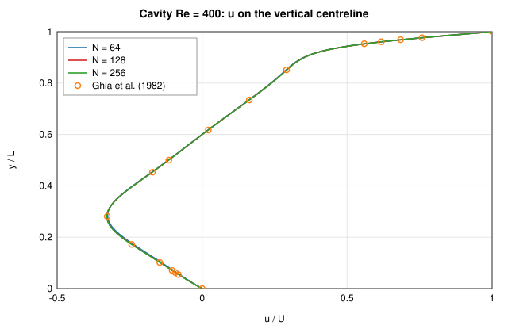

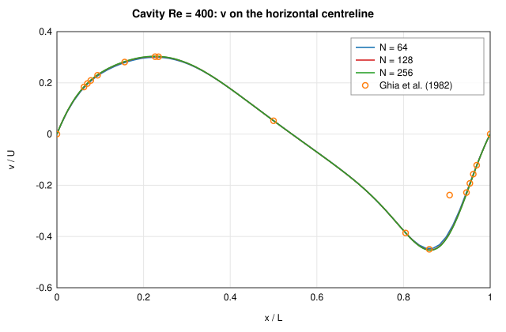

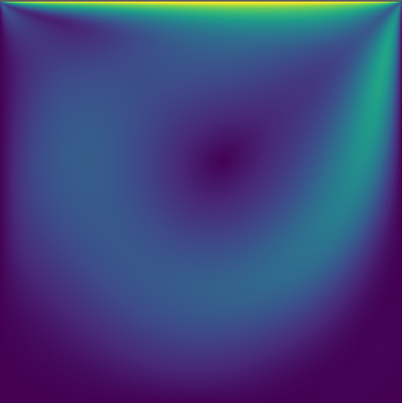
*Velocity magnitude |u|/U at Re = 400, N = 256*

Runs

| Run | Fluid cells | Steps | Time | MLUPS | Converged |
|-----|-------------|-------|------|-------|-----------|
| N = 64 | 4096 | 32000 | 3.2 s | 41 | yes |
| N = 128 | 16384 | 63200 | 13.5 s | 77 | yes |
| N = 256 | 65536 | 126400 | 59.1 s | 140 | yes |

## Lid-driven cavity, Re = 1000 — ✅ pass

*Case `cavity-re1000`. Reference: Ghia, Ghia & Shin (1982), J. Comput. Phys. 48, 387–411, Tables I–II.*

Square cavity of side 1 m, lid at 1 m/s, ν = 0.0010 m²/s; N² fluid cells, lid lattice velocity 0.08 (Ma ≈ 0.14). Run until the relative change of u over half a lid transit is below 1e-5. The centreline profiles are averaged over the two middle columns/rows and linearly interpolated (walls half-way) at Ghia's points; the 15 interior points of each profile are compared. Errors are relative to the lid velocity.

| Quantity | Value | Reference | Error | Limit | Result |
|----------|-------|-----------|-------|-------|--------|
| max \|u − u_Ghia\| / U at N = 256 | 0.006430 | 0 (limit 2%) | 0.006430 | 0.02000 | ✅ pass |
| max \|v − v_Ghia\| / U at N = 256 | 0.01603 | 0 (limit 2%) | 0.01603 | 0.02000 | ✅ pass |

**Deviation from Ghia et al. (1982) by resolution**

| N | max |Δu|/U | max |Δv|/U | u relative L2 | v relative L2 |
|---|---|---|---|---|
| 64 | 0.0173 | 0.0105 | 2.628e-2 | 1.669e-2 |
| 128 | 0.0073 | 0.0110 | 1.175e-2 | 1.871e-2 |
| 256 | 0.0064 | 0.0160 | 1.075e-2 | 2.663e-2 |

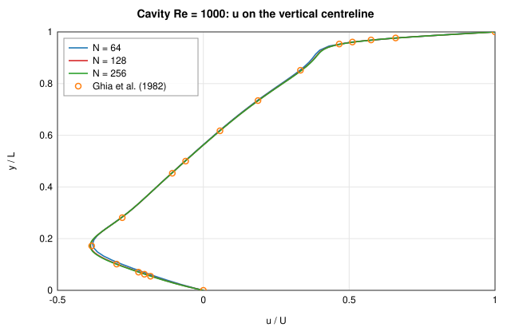

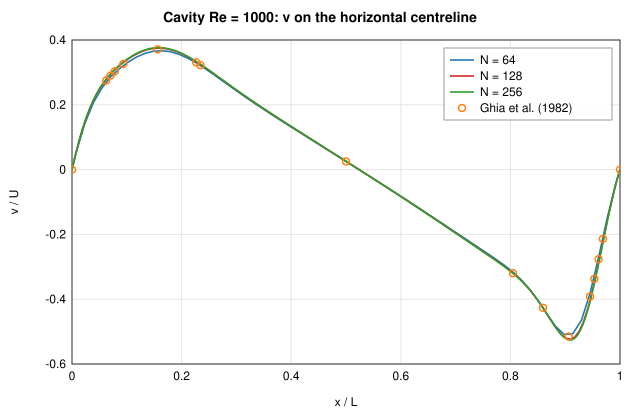

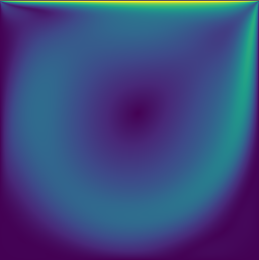
*Velocity magnitude |u|/U at Re = 1000, N = 256*

Runs

| Run | Fluid cells | Steps | Time | MLUPS | Converged |
|-----|-------------|-------|------|-------|-----------|
| N = 64 | 4096 | 49200 | 5.1 s | 40 | yes |
| N = 128 | 16384 | 108000 | 16.8 s | 105 | yes |
| N = 256 | 65536 | 222400 | 93.3 s | 156 | yes |

## Cylinder in a channel, Re = 20 (Schäfer-Turek 2D-1) — ✅ pass

*Case `cylinder-re20`. Reference: Schäfer & Turek (1996), Notes Numer. Fluid Mech. 52, 547–566.*

Channel 2.2 m × 0.41 m, cylinder D = 0.1 m at (0.2, 0.2) m drawn as cells, parabolic inlet with U_max = 0.3 m/s (Ū = 0.2 m/s, Re = ŪD/ν = 20), zero-pressure outlet; inlet peak lattice velocity 0.08. Run until the relative change of u over 0.25 s is below 1e-6. C_D, C_L from momentum exchange on the cylinder; Δp between the fluid cells next to the front and back points. Pass/fail: C_D within 2% of the centre of the reference interval at the finest resolution.

| Quantity | Value | Reference | Error | Limit | Result |
|----------|-------|-----------|-------|-------|--------|
| C_D at D = 40 cells | 5.600 | 5.580 (interval 5.570 – 5.590) | 0.003622 | 0.02000 | ✅ pass |
| C_L at D = 40 cells | 0.01225 | 0.01040 – 0.01100 |  |  | info |
| Δp (Pa) at D = 40 cells | 0.1153 | 0.1172 – 0.1176 |  |  | info |

**Results by resolution**

| D (cells) | C_D | C_D error | C_L | Δp (Pa) |
|---|---|---|---|---|
| 20 | 5.6092 | +0.52% | 0.0125 | 0.1136 |
| 40 | 5.6002 | +0.36% | 0.0122 | 0.1153 |

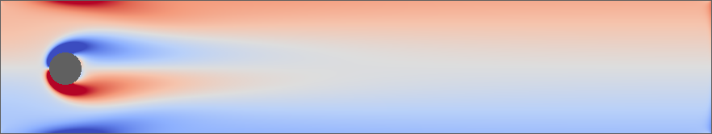
*Vorticity at Re = 20, D = 40 cells (steady)*

Runs

| Run | Fluid cells | Steps | Time | MLUPS | Converged |
|-----|-------------|-------|------|-------|-----------|
| D = 20 cells | 35764 | 37500 | 10.0 s | 134 | yes |
| D = 40 cells | 143056 | 75000 | 58.2 s | 184 | yes |

## Cylinder in a channel, Re = 100 (Schäfer-Turek 2D-2) — ✅ pass

*Case `cylinder-re100`. Reference: Schäfer & Turek (1996), Notes Numer. Fluid Mech. 52, 547–566.*

Same channel and cylinder as 2D-1 with U_max = 1.5 m/s (Ū = 1 m/s, Re = 100); inlet peak lattice velocity 0.08. The run continues in 1 s windows until the C_L amplitude changes by less than 1% between windows, then records 3 s (≈ 9 shedding periods). St = fD/Ū from the upward zero crossings of C_L; C_D,max and C_L,max over the record. Pass/fail: St and C_D,max within 2% of the centre of the reference intervals at the finest resolution.

| Quantity | Value | Reference | Error | Limit | Result |
|----------|-------|-----------|-------|-------|--------|
| St at D = 80 cells | 0.3000 | 0.3000 (interval 0.2950 – 0.3050) | 1.130e-4 | 0.02000 | ✅ pass |
| C_D,max at D = 80 cells | 3.258 | 3.230 (interval 3.220 – 3.240) | 0.008651 | 0.02000 | ✅ pass |
| C_L,max at D = 80 cells | 0.9905 | 0.9900 – 1.010 |  |  | info |

**Results by resolution**

| D (cells) | St | St error | C_D,max | C_D,max error | C_L,max | record starts at t (s) |
|---|---|---|---|---|---|---|
| 20 | 0.2963 | -1.24% | 3.3879 | +4.89% | 1.0226 | 7.0 |
| 40 | 0.2993 | -0.22% | 3.3424 | +3.48% | 0.9953 | 5.0 |
| 80 | 0.3000 | +0.01% | 3.2579 | +0.87% | 0.9905 | 9.0 |

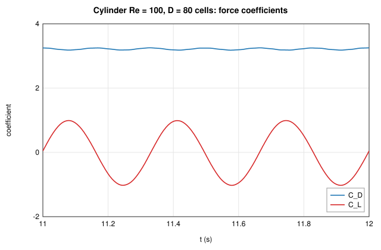

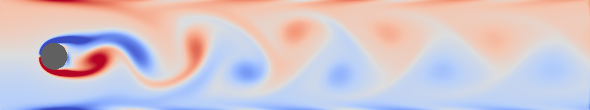
*Vorticity at Re = 100, D = 80 cells, t = 12.00 s: von Kármán vortex street*

Runs

| Run | Fluid cells | Steps | Time | MLUPS | Converged |
|-----|-------------|-------|------|-------|-----------|
| D = 20 cells | 35764 | 37500 | 11.6 s | 116 | yes |
| D = 40 cells | 143056 | 60000 | 47.8 s | 179 | yes |
| D = 80 cells | 572256 | 180000 | 691.6 s | 149 | yes |

## Differentially heated cavity, Ra = 1e3 — ✅ pass

*Case `heated-cavity-ra1e3`. Reference: de Vahl Davis (1983), Int. J. Numer. Meth. Fluids 3, 249–264.*

Square cavity of side L = 1 m, N² fluid cells; hot left wall, cold right wall (ΔT = 1 K), adiabatic top and bottom; Pr = 0.71, Boussinesq buoyancy. The buoyancy velocity √(gβΔTL) maps to lattice velocity 0.08. Run until u and θ change by less than 1e-5 (relative) over half a buoyancy time. Nu on the hot wall from a second-order one-sided temperature gradient at the half-way wall; Nū as the cavity average 1 + L⟨uθ⟩/(αΔT); velocity maxima on the mid-planes refined with a parabola, in units of α/L. Pass/fail: both Nusselt numbers within 2% at the finest resolution.

| Quantity | Value | Reference | Error | Limit | Result |
|----------|-------|-----------|-------|-------|--------|
| Nu on the hot wall at N = 128 | 1.118 | 1.117 | 6.149e-4 | 0.02000 | ✅ pass |
| Nū (cavity average) at N = 128 | 1.118 | 1.118 | 2.835e-4 | 0.02000 | ✅ pass |
| u_max on x = 0.5 (α/L) | 3.649 | 3.649 at y = 0.813 |  |  | info |
|   at y | 0.8131 | 0.8130 |  |  | info |
| v_max on y = 0.5 (α/L) | 3.698 | 3.697 at x = 0.178 |  |  | info |
|   at x | 0.1784 | 0.1780 |  |  | info |

**Results by resolution (reference: Nu_hot = 1.117, Nū = 1.118, u_max = 3.649 @ 0.813, v_max = 3.697 @ 0.178)**

| N | Nu hot wall | error | Nū | error | u_max @ y | v_max @ x |
|---|---|---|---|---|---|---|
| 64 | 1.1178 | +0.07% | 1.1178 | -0.02% | 3.648 @ 0.813 | 3.696 @ 0.179 |
| 128 | 1.1177 | +0.06% | 1.1177 | -0.03% | 3.649 @ 0.813 | 3.698 @ 0.178 |

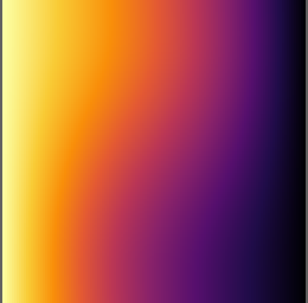
*Temperature (hot left, cold right) at Ra = 1e3, N = 128*

Runs

| Run | Fluid cells | Steps | Time | MLUPS | Converged |
|-----|-------------|-------|------|-------|-----------|
| N = 64 | 4096 | 16000 | 1.5 s | 45 | yes |
| N = 128 | 16384 | 32000 | 5.4 s | 97 | yes |

## Differentially heated cavity, Ra = 1e4 — ✅ pass

*Case `heated-cavity-ra1e4`. Reference: de Vahl Davis (1983), Int. J. Numer. Meth. Fluids 3, 249–264.*

Square cavity of side L = 1 m, N² fluid cells; hot left wall, cold right wall (ΔT = 1 K), adiabatic top and bottom; Pr = 0.71, Boussinesq buoyancy. The buoyancy velocity √(gβΔTL) maps to lattice velocity 0.08. Run until u and θ change by less than 1e-5 (relative) over half a buoyancy time. Nu on the hot wall from a second-order one-sided temperature gradient at the half-way wall; Nū as the cavity average 1 + L⟨uθ⟩/(αΔT); velocity maxima on the mid-planes refined with a parabola, in units of α/L. Pass/fail: both Nusselt numbers within 2% at the finest resolution.

| Quantity | Value | Reference | Error | Limit | Result |
|----------|-------|-----------|-------|-------|--------|
| Nu on the hot wall at N = 128 | 2.245 | 2.238 | 0.003133 | 0.02000 | ✅ pass |
| Nū (cavity average) at N = 128 | 2.245 | 2.243 | 8.572e-4 | 0.02000 | ✅ pass |
| u_max on x = 0.5 (α/L) | 16.18 | 16.18 at y = 0.823 |  |  | info |
|   at y | 0.8231 | 0.8230 |  |  | info |
| v_max on y = 0.5 (α/L) | 19.63 | 19.62 at x = 0.119 |  |  | info |
|   at x | 0.1190 | 0.1190 |  |  | info |

**Results by resolution (reference: Nu_hot = 2.238, Nū = 2.243, u_max = 16.178 @ 0.823, v_max = 19.617 @ 0.119)**

| N | Nu hot wall | error | Nū | error | u_max @ y | v_max @ x |
|---|---|---|---|---|---|---|
| 64 | 2.2474 | +0.42% | 2.2468 | +0.17% | 16.181 @ 0.823 | 19.629 @ 0.119 |
| 128 | 2.2450 | +0.31% | 2.2449 | +0.09% | 16.181 @ 0.823 | 19.634 @ 0.119 |

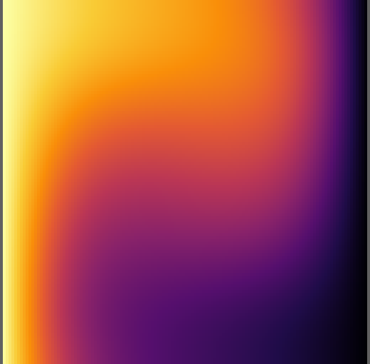
*Temperature (hot left, cold right) at Ra = 1e4, N = 128*

Runs

| Run | Fluid cells | Steps | Time | MLUPS | Converged |
|-----|-------------|-------|------|-------|-----------|
| N = 64 | 4096 | 28000 | 2.7 s | 43 | yes |
| N = 128 | 16384 | 56000 | 9.6 s | 96 | yes |

## Differentially heated cavity, Ra = 1e5 — ✅ pass

*Case `heated-cavity-ra1e5`. Reference: de Vahl Davis (1983), Int. J. Numer. Meth. Fluids 3, 249–264.*

Square cavity of side L = 1 m, N² fluid cells; hot left wall, cold right wall (ΔT = 1 K), adiabatic top and bottom; Pr = 0.71, Boussinesq buoyancy. The buoyancy velocity √(gβΔTL) maps to lattice velocity 0.08. Run until u and θ change by less than 1e-5 (relative) over half a buoyancy time. Nu on the hot wall from a second-order one-sided temperature gradient at the half-way wall; Nū as the cavity average 1 + L⟨uθ⟩/(αΔT); velocity maxima on the mid-planes refined with a parabola, in units of α/L. Pass/fail: both Nusselt numbers within 2% at the finest resolution.

| Quantity | Value | Reference | Error | Limit | Result |
|----------|-------|-----------|-------|-------|--------|
| Nu on the hot wall at N = 128 | 4.526 | 4.509 | 0.003865 | 0.02000 | ✅ pass |
| Nū (cavity average) at N = 128 | 4.525 | 4.519 | 0.001402 | 0.02000 | ✅ pass |
| u_max on x = 0.5 (α/L) | 34.75 | 34.73 at y = 0.855 |  |  | info |
|   at y | 0.8545 | 0.8550 |  |  | info |
| v_max on y = 0.5 (α/L) | 68.66 | 68.59 at x = 0.066 |  |  | info |
|   at x | 0.06611 | 0.06600 |  |  | info |

**Results by resolution (reference: Nu_hot = 4.509, Nū = 4.519, u_max = 34.73 @ 0.855, v_max = 68.59 @ 0.066)**

| N | Nu hot wall | error | Nū | error | u_max @ y | v_max @ x |
|---|---|---|---|---|---|---|
| 64 | 4.5468 | +0.84% | 4.5395 | +0.45% | 34.770 @ 0.854 | 68.554 @ 0.067 |
| 128 | 4.5264 | +0.39% | 4.5253 | +0.14% | 34.745 @ 0.854 | 68.656 @ 0.066 |

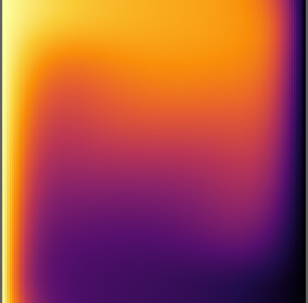
*Temperature (hot left, cold right) at Ra = 1e5, N = 128*

Runs

| Run | Fluid cells | Steps | Time | MLUPS | Converged |
|-----|-------------|-------|------|-------|-----------|
| N = 64 | 4096 | 56000 | 5.1 s | 45 | yes |
| N = 128 | 16384 | 104000 | 18.0 s | 95 | yes |

## Differentially heated cavity, Ra = 1e6 — ✅ pass

*Case `heated-cavity-ra1e6`. Reference: de Vahl Davis (1983), Int. J. Numer. Meth. Fluids 3, 249–264.*

Square cavity of side L = 1 m, N² fluid cells; hot left wall, cold right wall (ΔT = 1 K), adiabatic top and bottom; Pr = 0.71, Boussinesq buoyancy. The buoyancy velocity √(gβΔTL) maps to lattice velocity 0.08. Run until u and θ change by less than 1e-5 (relative) over half a buoyancy time. Nu on the hot wall from a second-order one-sided temperature gradient at the half-way wall; Nū as the cavity average 1 + L⟨uθ⟩/(αΔT); velocity maxima on the mid-planes refined with a parabola, in units of α/L. Pass/fail: both Nusselt numbers within 2% at the finest resolution.

| Quantity | Value | Reference | Error | Limit | Result |
|----------|-------|-----------|-------|-------|--------|
| Nu on the hot wall at N = 256 | 8.833 | 8.817 | 0.001838 | 0.02000 | ✅ pass |
| Nū (cavity average) at N = 256 | 8.831 | 8.800 | 0.003571 | 0.02000 | ✅ pass |
| u_max on x = 0.5 (α/L) | 64.84 | 64.63 at y = 0.85 |  |  | info |
|   at y | 0.8499 | 0.8500 |  |  | info |
| v_max on y = 0.5 (α/L) | 220.7 | 219.4 at x = 0.0379 |  |  | info |
|   at x | 0.03786 | 0.03790 |  |  | info |

**Results by resolution (reference: Nu_hot = 8.817, Nū = 8.8, u_max = 64.63 @ 0.85, v_max = 219.36 @ 0.0379)**

| N | Nu hot wall | error | Nū | error | u_max @ y | v_max @ x |
|---|---|---|---|---|---|---|
| 128 | 8.8692 | +0.59% | 8.8562 | +0.64% | 64.796 @ 0.849 | 220.901 @ 0.038 |
| 256 | 8.8332 | +0.18% | 8.8314 | +0.36% | 64.841 @ 0.850 | 220.706 @ 0.038 |

*Temperature (hot left, cold right) at Ra = 1e6, N = 256*

Runs

| Run | Fluid cells | Steps | Time | MLUPS | Converged |
|-----|-------------|-------|------|-------|-----------|
| N = 128 | 16384 | 224000 | 38.1 s | 96 | yes |
| N = 256 | 65536 | 432000 | 206.4 s | 137 | yes |

